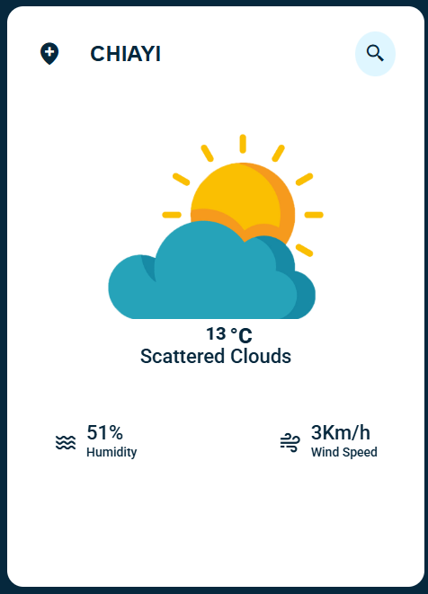

# Weather APP

A simple weather application that allows users to search for current weather conditions by entering a location. The application retrieves weather data using the OpenWeather API and displays relevant information, including temperature, weather description, humidity, and wind speed.

## Features

-   Search for weather information by location.
-   Displays:
    -   Temperature (in Celsius)
    -   Weather conditions (e.g., Clear, Rain, Snow, etc.)
    -   Humidity percentage
    -   Wind speed in Km/h
-   View detailed API response data in the browser's developer console

## Demo



## Installation

1. Clone the repository:

    ```bash
    git clone https://github.com/a0908512313/weather-app.git
    ```

2. Navigate to the project directory:
    ```bash
    cd weather-app
    ```

## Usage

1. Enter a location (e.g., "Chiayi") in the search box.
2. Click the search button or press `Enter`.
3. View the weather information or error message if the location is invalid.
4. To view the complete weather data:
   - Press ```F12``` or open and Developer Tools
   - Select the "Console" tab
   - The full API response data will be displayed in the console when you search for a location

## API Key Setup

This app uses the OpenWeather API. Replace the placeholder API key in the `index.js` file with your own API key:

```javascript
const APIKey = "your_api_key_here";
```

You can get a free API key by signing up at [OpenWeather](https://openweathermap.org/).

## Screenshots Invalid Location


Feel free to contribute by submitting issues or pull requests!
